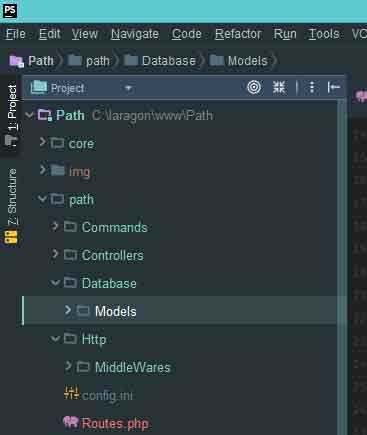

# Happy birthday to `Tshilidzi`! from Sulaiman Adewale :D 

# PHP Path

Path is an API-first PHP framework built with javascript in mind

## Contents

[Installation](#Installation) <br>
[Folder Structure](#Folder-Structure)


## Installation

create your project directory and initialize as git directory but running this command in that dir.
```bash
$ git init
```

pull Path's source to the directory you created with: 

```bash
$ git pull https://github.com/Wharley01/Path.git
```

If you are trying to download Path into an already existing git folder with unrelated history use:

```bash
$ git pull http://github.com/Wharley01/Path.git --allow-unrelated-histories
```

## Folder Structure
--- core\
------ \\...\
--- path\
------ Commands *<------ Contains All your custom Console Commands*\
------ Controllers *<------ Contains Your API Controller*\
------ Database \
--------- Models *<-------- Contains your Database Models*\
------------ \\...\
------ Http\
--------- MiddleWares *<-- Contains your Route MiddleWares*\
------------ \\...\
------ config.ini *<------ Your Configuration file*\
------ Routes.php *<------ Contains your routes*\

#### Folder structure In Image




## Your First API

The backbone of every application is having an interface to interact with your data in the database, which is what will be demonstrated in this section.

to create an API you need a router which will listen to a particular Route(or URL) and appropriate action may be taken and a response will be returned(shown) to user.

you can listen to your preferred URL(Route) with Path's Router, for example:

 
 You initiate the use of router
 ```php
use Path\Http\Router;

$router = new Router();
 ```
 
 proceed to listening to a request
   ```php
 use Path\Http\Request;

 $router = new Router();
 
 
 $router->get("/your/custom/route",function(){
     //do something here
  });
   ```
The code above does two things, the first is to listen for `GET` request to `/your/custom/route`(i.e: http://yourproj.dev/your/custom/route) while the second is to execute a particular `function` <br>

there can be multiple routers listening to different routes

   ```php
 use Path\Http\Request;

 $router = new Router();
 
  $router->get("/your/custom/route",function(){
     //do something here
  });
  
  $router->post("/another/custom/route",function(){
     //do something here
 });
   ```

Routes can be grouped too

```php
 use Path\Http\Request;
 use Path\Http\Router;

 $router = new Router();
 
  $router->group("/api/",function(Router $router){
   //   `$router` variable here is localized to this callback function
     //you can put multiple routes here
    $router->get("/user/custom/route",function(){
     //do something here
     //this listens to /api/user/custom/route
     });
     
     $router->post("/admin/route",function(){
     //do something here
     //this listens to /api/admin/route
     });

  });
```
The code above has a group router which contains 2 routers,
they both works according to

   ````
   NOTE: All routes codes must be written in path/Routes.php
   ````
   Now go on and visit http://yourproject.dev/your/custom/url you will get a json response
   
   
   ##### Other ways to use routes
   
   Note that we used `$response->json()` method to return a json response in our callback function, which will execute when our route(`/your/custom/path`) is requested, there are many other available in `Response $response` as listed below:

   1. json( array $array, $status = 200 )
   2. text( string $text, $status = 200 )
   3. htmlString( string $html, $status = 200 )
   4. html( string $file_path, $status = 200 )
   5. redirect( string $route, $status = 200 )
   
   Methods that can be chained with the response method
   
   1. addHeader(array $headers)

## Usage

```php
//code
```

## Contributing
Pull requests are welcome. For major changes, please open an issue first to discuss what you would like to change.

Please make sure to update tests as appropriate.

## License
[MIT](https://choosealicense.com/licenses/mit/)