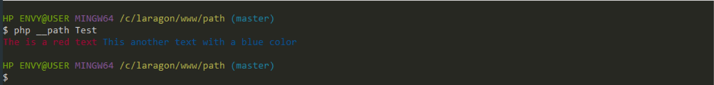

## Command Line Interface

The support for command line interface in Path is very straight-forward and super simple, as usual, it only takes creating a class in `path/Commands` with an interface of `Path\App\Commands` extending `Path\Core\CLI\CInterface` or let Path create it for you using the `php __path create command yourCommandFileName`. it's that simple, a typical Command Line File looks like this:

```php
<?php


namespace Path\App\Commands;


use Path\Core\CLI\CInterface;

class TestCommand extends CInterface
{


    /*
     * Command Line name
     *
     * @var String
     * */
    public $name = "Test";
    public $description = "This is just a test command interface file";

    public $arguments = [
        "key" => [
            "desc" => "just a test key"
        ]
    ];

    public function __construct()
    {
    }

    /**
     * @param $params
     * @return mixed|void
     */
    public function entry($params)
    {
        var_dump($params);
    }

```

#### Code explanation

1. `public $name` holds the command name (which is expected to be typed in the terminal after `php __path`)

2. `public $description` holds the description of this command, this will be shown when you run `php __path explain yourCommandName`

3. `public $arguments` hold an associative array of acceptable params `( Please note that parameters not explicitly specified here will be ignored or seen as a value )`

4. `public function entry($params)` executes when you run `php __path yourCommandName` with $params being an associative array where the key is the parameter and value is the text immediately next to the key in the terminal, for example, if you run:

```bash
php __path Test something key "another value with space"
```

The dumped value in entry() will look like this:

```php
<?php

array(2) {
  ["Test"]=> string(9) "something"
  ["key"]=> string(24) "another value with space"
}
```

if a key is included without a succeeding text, the key's value will be null

There are some inherited methods that can be handy, the table below shows them and their usage

### CLInterface methods

| Method | Description |
|:------ | ----------- |
| `ask(string $question,bool $enforce = false)` | Retrieves information/input from user through the console, returns user's input, null if no input was provided by the user|
| `confirm(string $question,array $yes_text = ['yes','y'],array $no_text = ['no','n'])` | Gets binary yes/no options from user,first argument sets the question to ask, the second argument accepts array of texts that passes as Yes, while the third argument accepts texts that passes as No |
| write(string $text,$format) | Writes to the console, There are ways to customize your text using a predefined pattern, read explanation below this table. |


#### Customizing Console text

To apply a custom colour to your text, you have to wrap it with \`color_name\`, below example shows writing a red and blue text to the console.

```php
<?php

...
    public function entry($params)
    {
        $this->write("`red`The is a red text`red` `blue`This another text with a blue color`blue`")
    }
...

```

running `php __path Test` would produce\
\


##### Available colors

| Colors |
|------- |
| black   |
| dark_gray |
| blue |
| light_blue |
| green |
| light_green |
| cyan |
| light_cyan |
| red |
| light_red |
| purple |
| light_purple|
| brown |
| yellow |
| light_gray |
| white |
| normal |

### Default Commands references

Below is the table of commands that are available by default
| Command | Usage |
| ------- | ----- |
| `php __path explain` or `php __path explain command:name` | show all available commands and their explanations or shows a specific command's explanation.|
|`php __path create controller yourControllerName` | Create Route/Live Controller |
| `php __path create command yourCommandName` | create new CLI Class and generates boilerplate code |
| `php __path create migration yourMigrationName` | Creates new database migration file/boiler plate |
| `php __path create middleware middleWareName` | Creates new middle ware boilerplate code file |
| `php __path create model yourTableModelName` | Generates a database table model boilerplate code |
|  `php __path create email MailableName` | Creates mailable boiler plate code|
| `php __path app install` or `php __path app install dbMigrationName` | install all database migration files or install a specific one| 
| `php __path app update` or `php __path app update dbMigrationName` | update all database migration files or update a specific one|
| `php __path app uninstall` or `php __path app uninstall dbMigrationName` | uninstall all database migration files or uninstall a specific one|
| `php __path app populate` or `php __path app populate dbMigrationName` | populate all database migration files or populate a specific one|
| `php __path app describe` or `php __path app describe dbMigrationName` | print/describe the database structure table into the console|
| `php __path watcher start` | Start watcher server (Needed if you are using Path Live Controller and WS as watch method in your configuration)|
